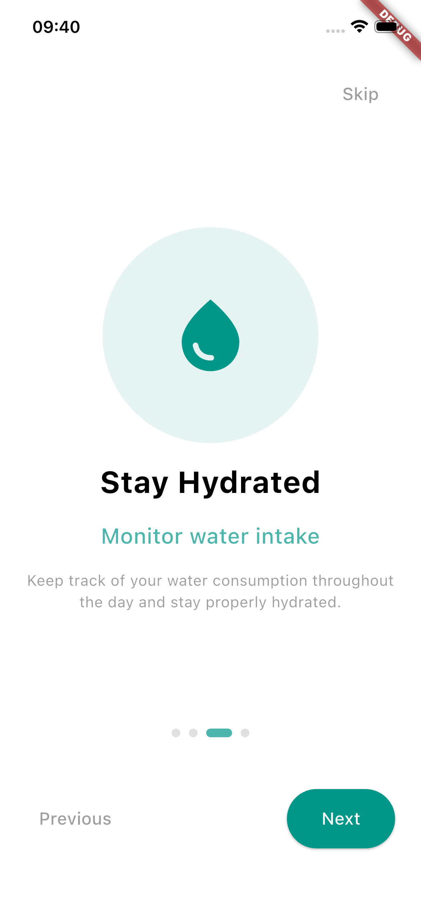
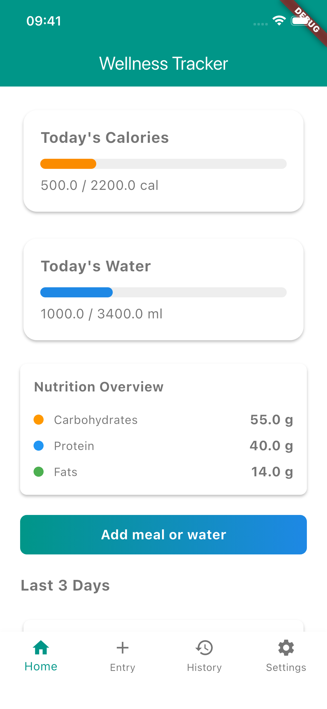
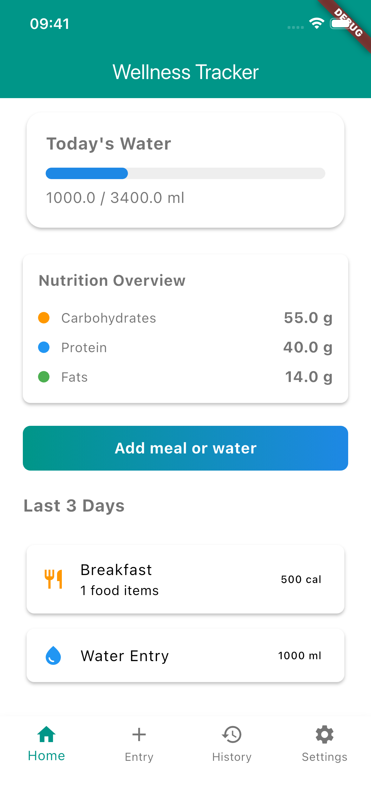
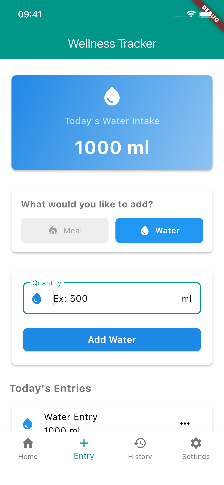
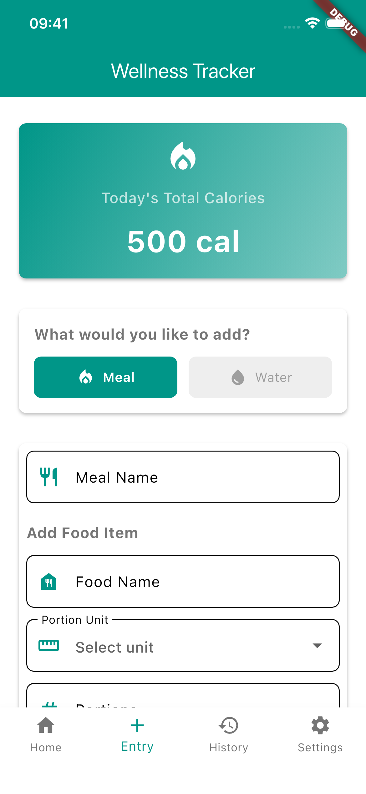
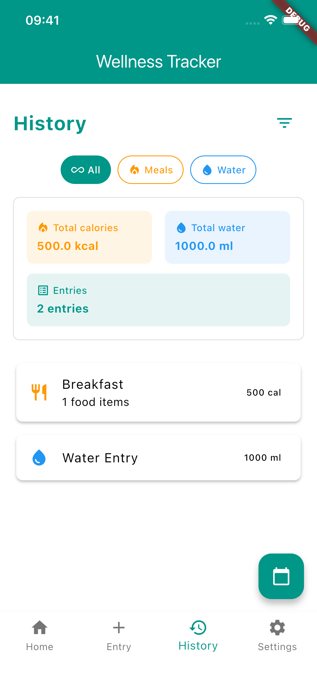
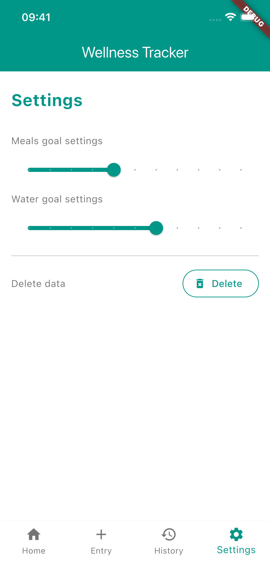

# 🌱 Daily Wellness Tracker

A Flutter application for tracking daily wellness activities including calorie intake and water consumption. Built with MVVM architecture and modern Flutter practices.

## Screenshots

  
  
  

  
  
  

  

## 📱 Features

### 🚀 **Onboarding**
- Smooth user introduction flow
- Feature highlights and setup guidance

### 🏠 **Dashboard**
- Real-time overview of today's wellness metrics
- Visual progress cards for calories and water intake
- Quick access buttons to add entries

### 📊 **Entry Management**
- **Smart Type Selector**: Toggle between calories (🔥) and water (💧) modes  
- **Real-time Totals**: Live updates of daily consumption
- **Recent Entries**: View today's logged entries with timestamps

### 📈 **History & Analytics**
- Complete history of all wellness entries
- **Advanced Filtering**: Filter by date ranges (7 days, 30 days, all time)
- **Date Picker**: Select specific dates to view historical data
- **Statistics**: Comprehensive stats for filtered data
- **Search**: Find entries efficiently

### ⚙️ **Settings**
- Setup goal preferences for calories and water

## 🏗️ Architecture

This project follows **Clean Architecture** principles with feature-based organization

### 🎯 **Design Patterns Used**
- **MVVM (Model-View-ViewModel)**: Clean separation of concerns
- **Provider Pattern**: State management with Provider
- **Repository Pattern**: Data access abstraction
- **Dependency Injection**: Modular and testable code structure

## 👨‍💻 Author

**Gabriel Amat**

**Made with ❤️ and Flutter**
